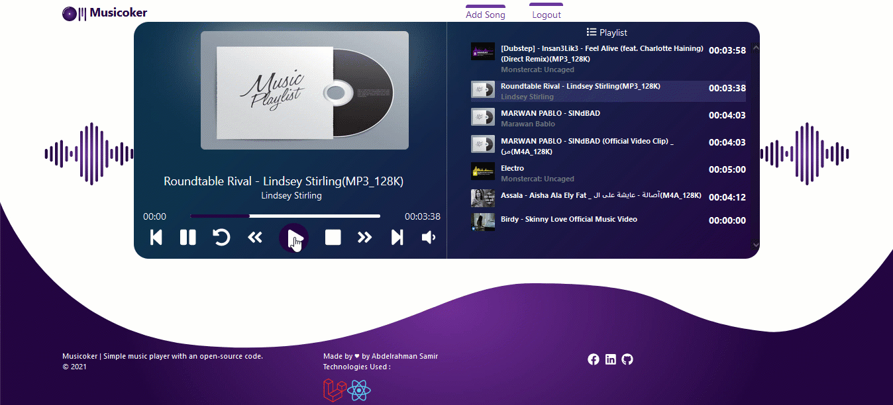

<span style="font-size:30px;color:#4C2276"> Musicoker | Music Player<span/>
<br/>


#### Music player created with Laravel 8 and React 17.0.2

- ReactJs 
- Laravel 
- MySQL <br/>

### Used Packages:
- Sanctum
- Getid3
- Bootstrap
- React Router Dom
- Sweet Alert 2
- React Icons
- Font Awesome
- Axios

<hr/>

## Installation

#### React Configuration

```sh
    cd musicoker-frontend
```

```sh
    npm install
```

```sh
    npm start
```

#### Laravel Configuration

```sh
    cd musicoker-backend
```

```sh
    composer install
```

```sh
    php artisan key:generate
```

```sh
    php artisan migrate
```

```sh
    php artisan serve
```

#### Testing

> open: http://127.0.0.1:3000/